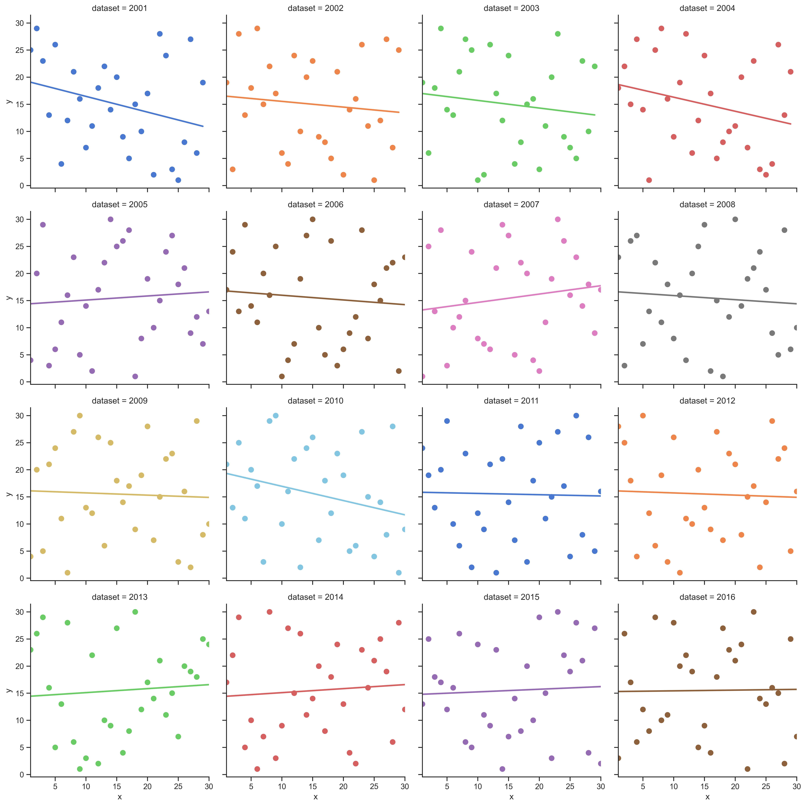
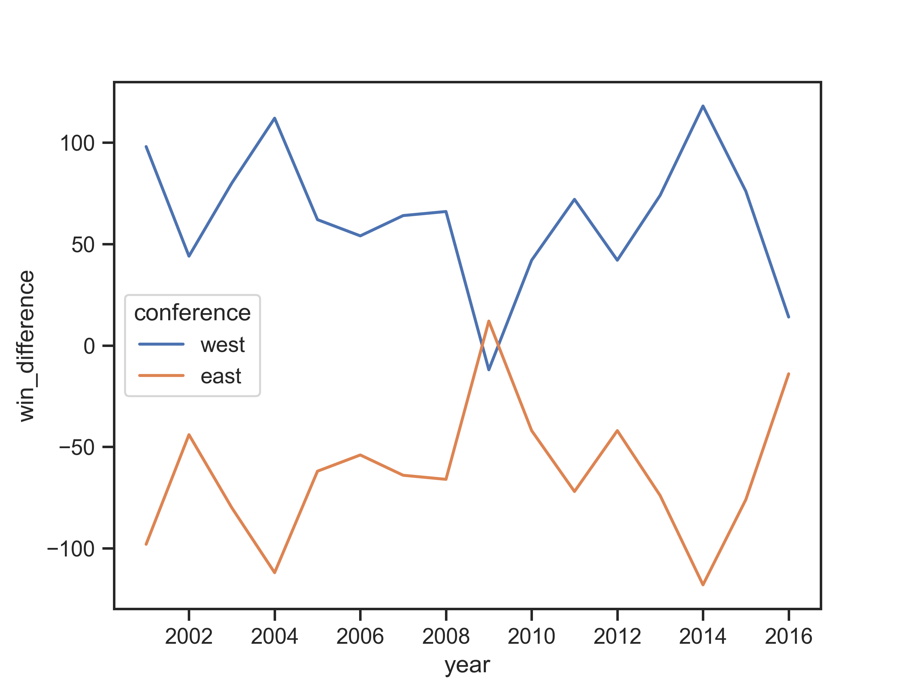

# NBA的球队战绩是否与城市经济挂钩的简单分析

## 前言

在写之前，我问过自己一些问题：为什么写这篇文，我希望写成什么样子呢？我想，大概要从前几年说起。

读书时期，身边总有些看NBA的朋友，我或多或少看了些，出名的球星可以叫出来些。
大概到毕业出来工作16年那会，才开始大规模看球。也得益于移动互联网，看球方便多了。

大概到18年赛季结束，我想着也看了一段时间了，心里有个念想，想起码输出点东西作为我看球的记忆点也好正反馈也好。

好，那么问题就到了我希望写成什么样子呢？

18年那会看了《约翰·伍登的UCLA大学进攻战术体系》，会有时看下basketball reference等数据网站。
恰逢刚看完总决赛，就觉得勇士太厉害了，想着就分析勇士的战术吧。

可是，分析战术在文章里截出大堆比赛截图，我总觉得有点别扭。
更重要的是，我希望结合我自己的专业去解决些问题会有意思些。而且，转念想，一路过来无论同学还是网友，总会有关于西强东弱的争论。
不过，网上却众说纷纭。我当时就想，可不可能和经济有关系呢，于是，想从这个角度做一些自己的阐述。

## 计划

问题是，nba的球队战绩是否和经济有关。
那么

1.收集战绩数据，经济数据用GDP衡量

2.数据分析

分析公式：分别将球队战绩、球队所在城市GDP做两个排名，做一个线性回归分析。

第二问题，NBA是否西强东弱（顺带分析）

1. 收集战绩数据
2. 数据分析

分析公式：
首先，NBA有些球队不是一个赛季只碰面两次的。
一般同分区的球队，一个赛季可能有四次碰面。
而一支球队与不同分区的球队一个赛季只会碰2次（主客场）。

那问题就是，怎么抵消同分区的战绩干扰，分析不同分区球队的对战战绩。
最后想到用胜场系数来评判，即是用同分区的胜场数减去同分区的负场数，那么就得出了该分区对战另一分区的总战绩了。
然后逐年的总战绩拉一个趋势出来就可以看出是不是有西强或者东强的痕迹了。

## 遇到的情况

* 数据获取
  
  数据获取用了两个月时间。球队战绩容易些。
  而球队所在城市GDP是则是意料之外的难找到。找不到旧数据，GDP很多没有以市单位的。我尝试了google、quora等，在虎扑、知乎寻求了些
  在国外城市数据有相关回答经验的大佬也没有找到。
  
  最终在google公共数据库里，找到了2001-2016的美国各市GDP数据。所以，分析会局限在这个时间区间。
  
    
* 球队改城市、改名字、变分区、2011-2012为缩水赛季

  主要影响数据库表结构，和数据爬取程序出错。

  
## 结果分析

### nba的球队战绩是否和经济有关

好，脚本拉去整理数据，排序然后seaborn线性回归分析。如下图，

额，脸好疼，谁打我脸。。我一直以为是成正相关的。
可是咋一看图，点乱麻麻的分布在各处，这貌似显示战绩和经济没有关系。

为什么我觉得和经济相关呢？
事实上，从总冠军数据来看，整个历史长河，赢得大于两个总冠军的球队，除了圣安东尼奥，其余都是GDP名列前茅的。
从个体来看，拿湖人来说，贾巴尔（天勾，历史得分榜第一名），奥尼尔（我认为是历史第一中锋），勒布朗詹姆斯（算历史第一大前锋）都选择了转会湖人，
并且对湖人夺冠起了直接作用。
大城市对于球星的吸引力，看每年的交易期可容易看到。
大城市的人口，消费水平，影响力，曝光，辐射力都是小城市不能比拟的。

综上，我认为，经济和战绩没有必然关系，只是影响战绩的其中一个因素。
为什么呢，因为影响战绩的因素还有，每年的乐透选秀（我认为算是小球市球队夺冠的较重要事件），
球队的教练团队水平（比如，五冠马刺），球队总经理的运营能力，球队老板的考量，甚至还有地理因素、城市关注度（因为会有NFL等职业比赛分流了）等较外围因素。

如果要严谨的测算的话，需要控制好其他变量的影响。

### 千禧年后东西强弱分析

这是附带分析，想着既然把战绩找来了，正好可以分析下西强东弱究竟是感官上的错觉，还是确有其事呢。

结果如图，可知，在千禧年后，西部整体对阵东部球队除2009年外都是领先的，而且不少年份还大幅领先（大于50场）。

结论，千禧年后，整体来看联盟实力西强东弱。

### 回顾

对于数据，我获取的时间线还不够长。时间线拉的不够长会导致不利于观察和分析规律。
另一方面来讲，数据挺重要的。找数据用了两个多月，编码（爬数据入库、数据分析、图表生成）加上写文章大约1个星期。

对于结果后续，
可以尝试把教练团队水平，乐透秀，总经理交易水平，球迷人数考虑进去。
这样能相对抹平其他变量对于这个问题的干扰。
不过那些因素其实很难衡量，没有一个绝对的衡量标准，
我认为可以通过建立一个自己的打分系统去做（将教练水平打分，球员潜力兑现打分，每笔交易打分）。

对于经济，
看到GDP数据比较，感叹洛杉矶和纽约的辐射能力，也感到了城市群里分工明确，
我个人以为在进入城镇化晚期的我国，估计最终也会呈现这个局面。

